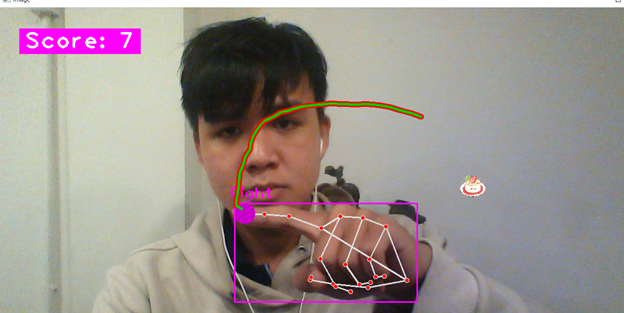

"# Snake-with-Opencv" 
-	Use camera detected hand (model available: cvzone) -> define location hand(point)-> Control head snake
-	Draw snake:
    + Define val init
    +	Cal distance 
    +	Update
-	Handle image food:
    +	Random food
-	Check for collision:
    + End game

"# Result#"

